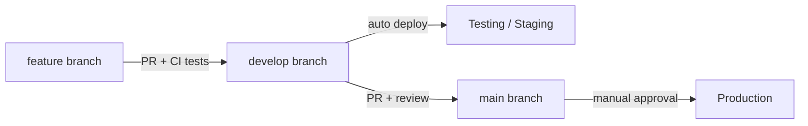

# R&I Backend

FastAPI backend with **testing** and **production** environments and GitHub Actions CI/CD.

## Branch & environment flow



| Branch    | Environment | Deploy trigger        |
|-----------|-------------|------------------------|
| `develop` | Testing     | Push to `develop`      |
| `main`    | Production  | Push to `main` (with GitHub environment approval) |

**Workflow:** develop on a feature branch → open PR to `develop` → CI runs tests → merge → auto-deploy to **testing** → verify → PR `develop` → `main` → approve production deploy → **live**.

## Project layout

Feature-based modules: each service (e.g. **login/auth**) has its own `models` → `repository` → `service` → `router`.

```
app/
  api/v1/router.py      # Wires module routers together
  common/               # Shared exceptions, base repository
  core/                 # DB session, JWT, dependencies
  db/                   # SQLAlchemy base, engine, model registry
  modules/
    auth/               # Login service
      models.py         # User table
      repository.py     # DB access
      service.py        # Business logic
      schemas.py        # Request/response DTOs
      router.py         # POST /auth/login, /register, GET /me
    health/
    users/              # Scaffold for next feature
    _template/          # How to add a new module
tests/modules/auth/     # Per-module tests
docs/ARCHITECTURE.md    # Full structure & layer rules
```

See [docs/ARCHITECTURE.md](docs/ARCHITECTURE.md) for diagrams and how to add new services.

**Full API reference:** [docs/API.md](docs/API.md) — auth, shop, cart, checkout, addresses, order tracking, and cURL examples.

## Local development

```bash
python -m venv .venv && source .venv/bin/activate
make install
cp .env.example .env
make dev          # http://localhost:8000 — docs at /docs
make test
```

## API endpoints

| Method | Path                    | Description        |
|--------|-------------------------|--------------------|
| GET    | `/`                     | App info           |
| GET    | `/api/v1/health`        | Health check       |
| GET    | `/api/v1/ready`         | Readiness          |
| POST   | `/api/v1/auth/register` | Create account     |
| POST   | `/api/v1/auth/login`    | Login → JWT        |
| GET    | `/api/v1/auth/me`       | Current user (Bearer token) |

Shop, cart, checkout, addresses, and order tracking: see **[docs/API.md](docs/API.md)**.

OpenAPI docs are enabled for `local` and `testing`; disabled in `production`.

## GitHub setup

### 1. Repository branches

Create and protect:

- `develop` — integration / testing
- `main` — production

### 2. GitHub Environments

In **Settings → Environments**, create:

**`testing`**

| Type   | Name            | Example                          |
|--------|-----------------|----------------------------------|
| Secret | `DEPLOY_HOST`   | staging server IP                |
| Secret | `DEPLOY_USER`   | `deploy`                         |
| Secret | `DEPLOY_SSH_KEY`| Private SSH key                  |
| Secret | `DEPLOY_PATH`   | `/opt/ri-backend`                |
| Secret | `SECRET_KEY`    | Strong random string             |
| Secret | `DATABASE_URL`  | Test DB connection string        |
| Variable | `CORS_ORIGINS`| `https://staging.example.com`    |
| Variable | `TESTING_URL` | `https://staging.example.com`    |

**`production`**

Same secrets (production values). Add **Required reviewers** for manual approval before deploy.

| Variable | `PRODUCTION_URL` | `https://api.example.com` |

### 3. Server prerequisites

On each deploy host:

```bash
# Install Docker + compose plugin
sudo apt install docker.io docker-compose-plugin
mkdir -p /opt/ri-backend
# Copy repo or let CI deploy compose files via checkout on first run
```

Login to GHCR on the server (once):

```bash
echo $GITHUB_TOKEN | docker login ghcr.io -u USERNAME --password-stdin
```

Update `IMAGE_NAME` in compose files to match `ghcr.io/<your-org>/<repo>`.

### 4. First push

```bash
git init
git add .
git commit -m "Initial FastAPI structure with CI/CD"
git remote add origin git@github.com:YOUR_ORG/ri-backend.git
git branch -M main
git checkout -b develop
git push -u origin develop main
```

## CI/CD workflows

| Workflow           | Trigger              | Action                          |
|--------------------|----------------------|---------------------------------|
| `ci.yml`           | PR / push            | Lint, pytest, Docker build      |
| `cd-testing.yml`   | Push to `develop`    | Build image → deploy testing    |
| `cd-production.yml`| Push to `main`       | Build image → deploy production |

## Environment variables

See `.env.example`, `.env.testing.example`, `.env.production.example`.

Key variable: `ENVIRONMENT` = `local` | `testing` | `production`

## Manual deploy

On the server:

```bash
export IMAGE_NAME=ghcr.io/your-org/ri-backend
export IMAGE_TAG=develop   # or latest for production
./scripts/deploy-remote.sh testing
./scripts/deploy-remote.sh production
```

## Customization

- New feature: copy pattern from `app/modules/auth/` or `app/modules/_template/`
- Register models in `app/db/registry.py`, router in `app/api/v1/router.py`
- Adjust deploy steps in `.github/workflows/` for Kubernetes, AWS ECS, etc.
