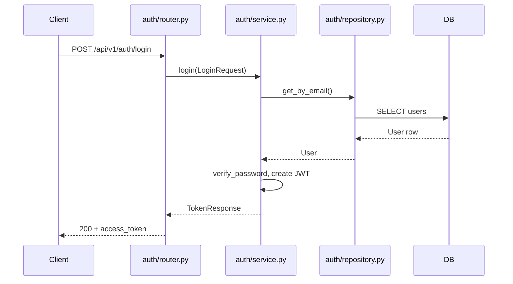

# Architecture

Layered, **feature-module** layout. Each business capability (login, users, orders, …) is a self-contained folder under `app/modules/`.

## Full folder structure

```
R&I_backend/
├── app/
│   ├── main.py                 # App factory, lifespan (DB init)
│   ├── config.py               # Settings per environment
│   │
│   ├── api/                    # API versioning only
│   │   └── v1/
│   │       └── router.py       # Mounts all module routers
│   │
│   ├── common/                 # Shared across modules
│   │   ├── exceptions.py
│   │   └── base_repository.py
│   │
│   ├── core/                   # App-wide infrastructure
│   │   ├── database.py         # get_db dependency
│   │   ├── deps.py             # Auth, settings dependencies
│   │   └── security.py         # JWT, password hashing
│   │
│   ├── db/                     # Database bootstrap
│   │   ├── base.py             # SQLAlchemy Base
│   │   ├── session.py          # Engine, sessions, create_tables
│   │   └── registry.py         # Import all models here
│   │
│   └── modules/                # ★ One folder per service/feature
│       ├── auth/               # Login service (example)
│       │   ├── models.py       # ORM: User table
│       │   ├── schemas.py      # API: LoginRequest, TokenResponse
│       │   ├── repository.py   # DB: get_by_email, create
│       │   ├── service.py      # Logic: login(), register()
│       │   └── router.py       # HTTP: POST /auth/login
│       │
│       ├── health/
│       │   └── router.py
│       │
│       ├── users/              # Scaffold for next feature
│       │   └── __init__.py
│       │
│       └── _template/          # Copy when adding a new module
│           └── README.md
│
├── tests/
│   ├── conftest.py
│   ├── test_health.py
│   └── modules/
│       └── auth/
│           └── test_auth.py
│
├── docs/
│   └── ARCHITECTURE.md
│
├── requirements/
├── scripts/
└── .github/workflows/
```

## Request flow (login example)



## Layer rules

| Layer | May use | Must not |
|-------|---------|----------|
| **router** | service, schemas | SQL, business rules |
| **service** | repository, schemas, core | HTTP types |
| **repository** | models, session | HTTP, JWT |
| **models** | db.base | FastAPI, Pydantic |
| **schemas** | — | DB session |

## Adding a new service (e.g. `orders`)

1. Create `app/modules/orders/` with `models`, `schemas`, `repository`, `service`, `router`.
2. Import models in `app/db/registry.py`.
3. Register router in `app/api/v1/router.py`.
4. Add `tests/modules/orders/`.

See `app/modules/_template/README.md`.
